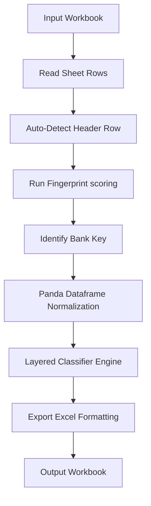

# Narration Automation Engine (v2.0)

A generalised multi-bank transaction classification, enrichment, and consolidation engine for financial analysis (Indian Banking System).

This engine processes complex bank statements across multiple financial institutions (supporting HDFC, Axis, SBI, Kotak Mahindra, Federal/Jupiter, SBM), automatically identifies files, header offsets, normalizes diverse column configurations, classifies transactions using a layered rule chain, scores them with a confidence score, and compiles a comprehensive, styled Excel spreadsheet including per-bank ledgers, Tally-ready sheets, consolidated summaries, and financial pivots.

---

## 📂 Project Architecture & Directory Layout

The codebase is organized as a structured Python package (`narration_engine`) with a standalone CLI runner (`run_narration.py`).

```text
e:/Tax/scripts/
├── run_narration.py                  # CLI Main entry point (parses args & runs pipeline)
├── narration_engine/                 # Core engine package
│   ├── __init__.py                   # Package initialization
│   ├── auto_header.py                # Generic spreadsheet header offset detector
│   ├── bank_registry.py              # Central schema repository for all banks & VPAs
│   ├── bank_identifier.py            # Fingerprint matcher (Metadata + Header scoring)
│   ├── classifier.py                 # Core layered classification driver (the rule pipeline)
│   ├── merchants.py                  # Extensive merchant UPI VPA match mapping
│   ├── exporter.py                   # Excel worksheet formatter & workbook writer
│   ├── rules_common.py               # Cross-bank global classification rules
│   ├── rules_axis.py                 # Axis Bank-specific patterns
│   ├── rules_federal.py              # Federal Bank (Jupiter)-specific patterns
│   ├── rules_hdfc.py                 # HDFC Bank-specific patterns
│   ├── rules_kotak.py                # Kotak Mahindra Bank-specific patterns
│   ├── rules_sbi.py                  # State Bank of India-specific patterns
│   └── rules_sbm.py                  # SBM Bank-specific patterns
```

---

## 🚀 Execution & Command-Line Interface

The engine uses standard CLI arguments to process bank statement files. It automatically looks for inputs matching a predefined pattern if no arguments are provided.

### Standard Command
To run classification for a specific Financial Year (e.g., FY25):
```bash
python run_narration.py --fy FY25
```

### Options Reference
| Argument | Default Behavior | Description |
| :--- | :--- | :--- |
| `--fy` | `FY25` | Financial Year tag. Determines default input/output paths. |
| `--input` | Auto-detected | Absolute path to the source multi-sheet Excel file. |
| `--output` | Auto-generated | Absolute path where the narrated Excel workbook will be written. |

### Auto-Discovery Rules
If `--input` is omitted, the engine scans the directory `E:\Tax\Generated Data\<FY>\`:
1. Looks for `All Bank Statements Aayush <FY>.xlsx`.
2. Falls back to search for any file matching `All Bank Statements*.xlsx` in that directory.
3. If no file is found, it exits with an error.

The default output path is: `E:\Tax\Generated Data\<FY>\All_Narrated_<FY>.xlsx`.

---

## ⚙️ Processing Pipeline Architecture



### 1. Header Offset Detection (`auto_header.py`)
Standard bank statement sheets often contain several metadata rows (statement parameters, customer details, bank addresses) before the actual table starts.
* The engine uses a generic algorithm to detect the header offset by scanning rows top-to-bottom.
* A row is marked as the header row if:
  - It contains **$\ge 4$ non-null** cells.
  - Contains at least one cell matching a **date keyword** (e.g., `date`, `txn date`, `value dt`, etc.).
  - Contains at least one cell matching an **amount keyword** (e.g., `debit`, `credit`, `balance`, `withdrawal`, etc.).
  - The sum of keyword matches is **$\ge 3$** (preventing false positives on metadata blocks containing solitary dates).

### 2. Bank Identification (`bank_identifier.py`)
Each sheet is scored against configurations declared in the [bank_registry.py](file:///e:/Tax/scripts/narration_engine/bank_registry.py):
* **Metadata Score** ($W_{\text{meta}} = 60\%$): Fraction of a bank's `meta_signals` (e.g., `HDFC BANK`, `UTIB`, `Drawing Power`) found anywhere in rows *above* the detected header.
* **Header Score** ($W_{\text{header}} = 40\%$): Fraction of a bank's `header_signals` (e.g., `Chq / Ref No.`, `Withdrawal Amt.`, `Closing Balance`) found in the header row columns.
* **Matching**: A sheet is successfully matched to a bank key if the combined score is $\ge 0.55$. Otherwise, it defaults to `"unknown"`.

* **Federal Bank Special Scans**: Federal Bank statements contain deep metadata headers (e.g., 18 rows before the header). In case auto-detection fails, `run_narration.py` does a full-text fallback scan for Federal keywords (`FDRL0007777`, `salary-7777`, etc.) and forces a manual offset search looking for the `Tran Type` or `Tran ID` column.

### 3. Normalization & Cleanup
* **Duplicate Headers**: For sheets like HDFC containing duplicate column names (e.g., "Narration" used both for raw particulars and manual comments), pandas automatically labels the second column as `Narration.1`. The engine detects this and maps `Particulars` to `Narration` and `Human_Narration` to `Narration.1`.
* **Kotak Dual-Indicator Mappings**: Kotak statements use a single `Amount` column and a `Dr / Cr` indicator column instead of separate debit/credit columns. The engine automatically splits this into separate `DR` and `CR` fields during normalization.
* **Null Filtering**: Transaction rows with blank particulars or descriptions are automatically discarded.

---

## 🧠 Layered Classification Engine (`classifier.py`)

Every normalized transaction is routed through a sequential, priority-based classification pipeline:

```text
               [Transaction Record]
                        │
                        ▼
          +───────────────────────────+
          │   1. Bank-Specific Rules  │ ---> Matches? ---> [Return Label]
          +───────────────────────────+
                        │ No
                        ▼
          +───────────────────────────+
          │    2. Common Rules List   │ ---> Matches? ---> [Return Label]
          +───────────────────────────+
                        │ No
                        ▼
          +───────────────────────────+
          │   3. Merchant UPI Scan    │ ---> Matches? ---> [Return Label]
          +───────────────────────────+
                        │ No
                        ▼
          +───────────────────────────+
          │    4. Fallback default    │ ---> [ "What is this?" ]
          +───────────────────────────+
```

1. **Bank-Specific Rules**: Checks `rules_<bank_key>.py`. Applied first to resolve bank-specific transactions (e.g., HDFC Securities transaction patterns, SBI bulk postings, Kotak self-transfers).
2. **Common Rules**: Checks the global database `rules_common.py` (excluding the fallback rule). Matches standard patterns like `Salary`, `Dividend Income`, `SIP`, `Advance Tax`, and standard family names.
3. **Merchant UPI Scan**: If the particulars string matches a UPI signature (e.g., `UPI/` or `UPIOUT/`), the engine routes the particulars string through `detect_merchant()` in `merchants.py`. It matches against 50+ configured merchant names (e.g., Zomato, Uber, BigBasket).
4. **Fallback Default**: If all rules fail to match, it classifies the transaction as `"What is this?"` with a `Suspense` Account Head and `0.0` confidence score.

---

## 📊 Confidence Scoring Model

Every classification returns a numerical confidence score which is formatted into the final sheets.

| Confidence Range | Meaning & Triggers | Action / Color Code |
| :--- | :--- | :--- |
| **0.95 – 1.00** | **High Specificity**: Exact pattern match (e.g., specific HSL codes, Salary credits, NACH mandates). | Safe. |
| **0.85 – 0.94** | **Moderate Specificity**: Target keywords matching directional rules (e.g., `RENT` debits, `DIV` credit keywords). | Safe. |
| **0.65 – 0.84** | **Merchant Matches**: Identified via merchant maps (e.g., Swiggy, Netflix). | Safe. |
| **0.55 – 0.64** | **Generic / Ambiguous**: Generic UPI debits or credits where the receiver's merchant details cannot be verified. | **Amber Highlight** in Excel (Alerts user to review). |
| **0.00** | **Unclassified**: Fallback indicator. | **Amber Highlight** + `"What is this?"` label. |

---

## 📈 Output Workbook Sheets (`exporter.py`)

The output workbook `All_Narrated_<FY>.xlsx` contains the following sheets:

### 1. Bank Ledger Sheets (e.g., `HDFC`, `KOTAK`, `SBI`)
* Contains all normalized transactions for that bank.
* Standardized columns: `Date`, `Particulars`, `Ref`, `Value_Date`, `DR`, `CR`, `Balance`, `Human_Narration`, `Auto_Narration`, `Account_Head`, `Confidence`, `Match`.
* **Amber Highlights**: Any row with `Confidence < 0.60` has its confidence cell colored in Amber (`#FFF3CC`).
* **Mismatch Detection (`Match`)**: If a historical `Human_Narration` column existed, the engine checks it against the `Auto_Narration`. If they differ significantly, the row is marked `[DIFF]` and styled in **Bold Red Font** (`#8B0000`). If they agree, it is marked `[MATCH]`.

### 2. For Tally Sheet
* A flat, unified chronological ledger containing transactions from all processed banks sorted by date.
* Standardized columns: `TX Date`, `Date`, `DR`, `CR`, `Narration`, `Confidence`, `Account Head`, `Account No`, `Kya Hai?`, `Particulars`, `Bank`.
* Uses matching color highlights for auto-narration labels to enable easy manual scanning.

### 3. Conso Sheet
* Features a summarized header block (Total Debits, Total Credits, Net Balance).
* A complete running-ledger view of all bank statements consolidated, with a running account balance column.

### 4. Bank Summary Sheet
* **Narration Pivot**: Side-by-side categorization showing Total Credit vs Total Debit sums per auto-narration label (e.g., Salary, SIP, Rent) color-coded to match the transaction rows.
* **Opening & Closing Balances**: A ledger auditing the resolved starting balances and closing balances per bank account.
* **Confidence Distribution**: A breakdown table showing the count and percentage of transactions categorized within the High, Medium, and Low confidence bands.

---

## 🛠️ Developer Guide: Extending the Engine

### How to Add or Update a UPI Merchant
1. Open [merchants.py](file:///e:/Tax/scripts/narration_engine/merchants.py).
2. Insert a tuple mapping the target keyword to its label, category, and default merchant confidence score ($0.68$):
   ```python
   MERCHANT_MAP: list[tuple[str, tuple[str, str, float]]] = [
       # ...
       ("starbucks",      ("UPI - Starbucks",    "Food & Dining",   0.68)),
       ("blinkit",        ("UPI - Blinkit",      "Groceries",       0.68)),
       # ADD NEW MERCHANTS HERE
   ]
   ```
   *Note: Place more specific keywords above generic keywords to prevent early triggers (e.g., match `"olaelectric"` before `"ola"`).*

### How to Add a New Bank Account
1. Open [bank_registry.py](file:///e:/Tax/scripts/narration_engine/bank_registry.py).
2. Insert a configuration block inside `BANK_REGISTRY`:
   ```python
   "icici": {
       "display_name"  : "ICICI Bank",
       "account_id"    : "ICICI 9999",
       "meta_signals"  : [
           "ICICI BANK LTD",
           "Statement of Account",
       ],
       "header_signals": [
           "Transaction Date",
           "Withdrawal (Dr)",
           "Deposit (Cr)",
           "Balance (Lcy)",
       ],
       "col_date"        : "Transaction Date",
       "col_particulars" : "Transaction Remarks",
       "col_narration_h" : "Narration",
       "col_dr"          : "Withdrawal (Dr)",
       "col_cr"          : "Deposit (Cr)",
       "col_balance"     : "Balance (Lcy)",
       "col_ref"         : "Reference/Chq No.",
       "col_value_date"  : "Value Date",
       "rules_module"    : "narration_engine.rules_icici",
   }
   ```
3. Create a rules file at `narration_engine/rules_icici.py` and declare a rules array containing custom regular expressions for bank-specific codes:
   ```python
   # rules_icici.py
   from __future__ import annotations
   import re

   RULES_ICICI: list[tuple] = [
       (
           "Bank Charges", "Bank Charges",
           lambda p, dr, cr: bool(re.search(r"CHG/|GST/", p, re.IGNORECASE)) and dr > 0,
           0.90,
       ),
   ]
   ```
4. The main pipeline (`run_narration.py`) will automatically pick up this bank configuration during the next execution. No other imports are needed.

---

## 🗂️ Narration Taxonomy & Mappings

The table below describes standard classifications, their assigned ledger Account Heads, and confidence metrics:

| Auto_Narration Label | Account Head | Direction | Primary Match Criteria / Pattern | Confidence |
| :--- | :--- | :--- | :--- | :--- |
| **Salary** | `Salary` | Credit | `SALARY`, `PAYROLL`, `PAYSLIP` | 0.95 |
| **Bank Interest** | `Bank Interest` | Credit | `Int.Pd`, `INTEREST PAID`, `SBINT:` | 0.90 – 0.95 |
| **Dividend Income** | `Dividend Income` | Credit | `ACH C-`, `NACH ECS CR`, `DIVIDEND`, `DIV` | 0.85 – 0.93 |
| **Annuity Income** | `Annuity` | Credit | `HDFCLIFE CENTR` | 0.95 |
| **Income Tax Refund** | `Income Tax` | Credit | `ITD TAX REFUND`, `TAX REFUND` | 0.95 |
| **MF Redemption** | `Mutual Funds` | Credit | `REDEMPTION`, AMC Names (CAMS, PPFAS, Quant) | 0.85 |
| **Upwork Income** | `Misc Income` | Credit | `UPWORK` | 0.95 |
| **Auto Sweep FD** | `Auto Sweep FD` | Both | `AUTOSWEEP`, `SWEEP TRF`, `REV SWEEP` | 0.82 – 0.95 |
| **SIP** | `SIP` | Debit | `NACH MUT DR`, `INDIANESIGN`, `BILLDK` | 0.90 – 0.96 |
| **Advance Tax** | `Advance Tax` | Debit | `ETAX`, `ADVANCE TAX`, `NSDL TDS` | 0.92 |
| **Bank Charges** | `Bank Charges` | Debit | `ISAQMC`, `SMS ALERT`, `Annual Fee`, `CHRGS` | 0.88 – 0.90 |
| **Depository Charges**| `Depository Charges` | Debit | `DEPOSITORY CHARGES`, `DEMAT CHG` | 0.93 |
| **Insurance Premium** | `Insurance` | Debit | `HDFCLIFE`, `STAR HEALTH`, `CARE HEALTH` | 0.88 – 0.95 |
| **Rent** | `Rent` | Debit | Landlord VPA, `RENT`, `NELABALLI`, `NAGARAJ` | 0.88 – 0.90 |
| **Zerodha Broking** | `Zerodha Broking Limited` | Debit | `ZERODHA` (not including NACH mut dr) | 0.92 |
| **Contra - SBI** | `SBI 1227` | Both | Self transfer refs (`SELF_UPI_REFS_SBI`) | 0.90 |
| **Contra - Kotak** | `KOTAK 0333` | Both | Self transfer refs (`SELF_UPI_REFS_SBI` / `SELF_UPI_REFS_JUPITER`) | 0.88 – 0.90 |
| **Contra - Jupiter** | `FEDERAL 0847` | Both | Self transfer refs (`SELF_UPI_REFS_JUPITER`) | 0.85 – 0.90 |
| **Cash Withdrawal** | `Cash` | Debit | `ATW/`, `ATM CASH`, `CWDR`, `ATL/` | 0.92 |
| **Card Purchase** | `Personal` | Debit | `PCD/` (Kotak Debit Card POS transaction) | 0.88 |
| **Credit Card Payment**| `Personal` | Debit | `MB:PAID CARD`, `CREDIT CARD PAY` | 0.90 |
| **UPI - <Merchant>** | Category (e.g. `Food`) | Debit | VPA pattern search matching Merchant List | 0.68 |
| **UPI Payment** | `Personal` | Debit | Unmatched generic outgoing UPI transaction | 0.55 |
| **UPI Receipt** | `Personal` | Credit | Unmatched generic incoming UPI transaction | 0.55 |
| **What is this?** | `Suspense` | Both | Unmatched fallback transaction | 0.00 |
