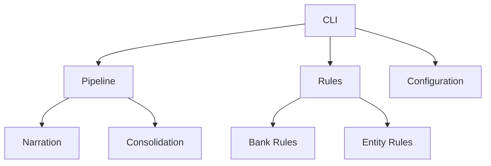

# Tax Automation System

Tax Automation System is a modular application for automating tax-related processes, including transaction classification, bank statement consolidation, and report generation.

## Table of Contents
- [Installation](#installation)
- [Usage](#usage)
- [Architecture](#architecture)
- [Configuration](#configuration)
- [Testing](#testing)
- [Contributing](#contributing)

## Installation

### Prerequisites
- Python 3.8+
- pip

```bash
# Clone the repository
git clone https://github.com/yourusername/tax-automation.git
cd tax-automation

# Install dependencies
pip install -r requirements.txt
```

## Usage

The CLI provides two main commands:

### Process Narration
```bash
python -m tax_automation process --entity ENTITY_ID --fy FY26
```

Options:
- `--entity`: Entity profile ID (required)
- `--fy`: Financial year (default: FY26)
- `--input`: Input Excel file path
- `--output`: Output Excel file path

### Consolidate Statements
```bash
python -m tax_automation consolidate --entity ENTITY_ID --fy FY26
```

## Architecture

The system follows a modular architecture:



Key Components:
- **CLI**: Command-line interface (`src/tax_automation/cli.py`)
- **Pipeline**: Core processing logic (`src/tax_automation/pipeline/`)
- **Rules**: Transaction classification rules (`src/tax_automation/rules/`)
- **Configuration**: YAML-based configuration (`src/tax_automation/config/`)
- **Exporters**: Output generation (`src/tax_automation/exporters/`)

## Configuration

Configurations are defined in YAML files under the `config/` directory:

### Entity Configuration
```yaml
# config/entities/{entity_id}.yaml
display_name: "Entity Name"
banks:
  hdfc:
    display_name: "HDFC Bank"
    account_id: "12345678"
    col_particulars: ["Particulars", "Description"]
    col_dr: "Debit"
    col_cr: "Credit"
output_sheet_names:
  - "Summary"
```

### Rules Configuration
```yaml
# config/rules/{entity_id}.yaml
rules:
  - label: "Salary Credit"
    head: "Salary"
    pattern: "SALARY|SAL CREDIT"
    confidence: 0.95
```

## Testing

Run tests with:
```bash
python -m unittest discover -s src/tax_automation/tests
```

## Contributing

1. Fork the repository
2. Create a feature branch: `git checkout -b feature/your-feature`
3. Commit changes: `git commit -m 'Add some feature'`
4. Push to the branch: `git push origin feature/your-feature`
5. Open a pull request

## License

MIT License